<div align="center">


</div>

---


### 👋 About Me

- 🚗 **HIL & Test Automation Engineer** at **Tata Consultancy Services**
- 🏎️ Working on **Jaguar Land Rover's Software-Defined Vehicle (SDV)** program
- 🐍 Building **Python BDD automation frameworks** (pytest + Behave) for ECU validation
- 🔬 Expert in **dSPACE HIL**, **Vector CANoe/CANalyzer**, **CAN/UDS diagnostics**
- ☁️ **AWS Certified DevOps Engineer – Professional** | GCP ACE | Azure Data Scientist
- 🔁 Integrating test pipelines into **GitLab CI/CD** for nightly automated regression
- 📊 Metrics that matter: **500+ automated test cases · 40% coverage improvement · 35% less manual effort**
- 📍 Based in **Pune, Maharashtra, India**
- 💬 Talk to me about: **Automotive Testing · Python Automation · HIL/SIL · DevSecOps**

<br clear="right"/>

---

## 🎯 What I Do

```python
class RakeshAragodi:

    role       = "HIL & Test Automation Engineer"
    company    = "TCS @ Jaguar Land Rover SDV"
    location   = "Pune, India"

    domains    = ["Automotive ECU Testing", "HIL/SIL Validation",
                  "Python Test Automation", "CI/CD Pipelines", "Cloud DevSecOps"]

    daily_tools = {
        "testing"    : ["pytest", "Behave BDD", "dSPACE ControlDesk", "AutomationDesk"],
        "automotive" : ["Vector CANoe", "CANalyzer", "UDS Diagnostics", "CAN FD", "LIN"],
        "cloud"      : ["AWS", "GitLab CI", "Terraform", "Docker", "Kubernetes (EKS)"],
        "languages"  : ["Python", "CAPL", "Bash", "C++"],
    }

    impact = {
        "test_cases_automated" : "500+",
        "coverage_improvement" : "40%",
        "manual_effort_saved"  : "35%",
        "critical_defects_caught_before_vehicle_integration": "20+",
    }
```

---

## 🛠️ Tech Stack

### 🐍 Python Test Automation


### 🚗 Automotive & HIL Tools


### ☁️ Cloud & DevSecOps


### 📋 Test Management & Reporting


---

## 📈 My Automation Journey

```mermaid
graph LR
    A[🐍 Python Basics] --> B[pytest & BDD]
    B --> C[CANoe COM API Integration]
    C --> D[dSPACE XIL API + HIL]
    D --> E[500+ Automated Test Cases]
    E --> F[GitLab CI/CD Pipelines]
    F --> G[Jira Xray API Traceability]
    G --> H[AWS EKS Cloud Deployments]
    H --> I[☁️ AWS DevOps Pro Certified]

    style A fill:#2E75B6,color:#fff
    style E fill:#1F3864,color:#fff
    style I fill:#FF9900,color:#fff
```



---

## 🏆 Certifications

<div align="center">

| Certification | Issuer | Level |
|:---|:---|:---|
| 🏅 **AWS Certified DevOps Engineer** | Amazon Web Services | Professional |
| 🏅 **Google Cloud Certified** | Google Cloud | Associate Cloud Engineer |
| 🏅 **Azure Data Scientist Associate** | Microsoft Azure | Associate |

</div>

---

## 🔬 Key Projects

### 🚗 JLR SDV — Python BDD Test Automation Framework
> *Jaguar Land Rover Software-Defined Vehicle Program @ TCS*

- Designed and delivered a **Python (Behave + pytest) BDD framework** for dSPACE HIL setups
- Automated **500+ Gherkin-based test cases** across **BCM and Infotainment ECUs**
- Improved validation coverage by **40%** and reduced manual reporting by **35%**
- Integrated **Jira Xray API** for automated requirements traceability
- Embedded in **GitLab CI/CD** for nightly regression runs

**Stack:** `Python` `pytest` `Behave` `dSPACE XIL API` `CANoe` `UDS` `GitLab CI` `Jira Xray` `openpyxl`

---

### 🔐 SDV DevSecOps Automation Pipeline
> *Cloud-native CI/CD for automotive validation environments*

- Architected end-to-end **GitLab CI/CD pipelines** with **AWS (EC2, S3, IAM, Lambda)**
- Provisioned infrastructure via **Terraform** — fully automated spin-up and teardown
- Integrated **Snyk security gates** — blocked **90%+ vulnerabilities** before production
- Containerised microservices with **Docker**, deployed on **AWS EKS**
- Built **CloudWatch dashboards** for pipeline health and test execution metrics

**Stack:** `GitLab CI` `Terraform` `AWS EKS` `Docker` `Snyk` `CloudWatch` `IAM`

---

## 📊 GitHub Stats

<div align="center">


&nbsp;&nbsp;


</div>

<div align="center">

</div>

---

## 🤝 Connect With Me

<div align="center">

[](https://linkedin.com/in/rakesharagodi)
[](mailto:rakesharagodi@gmail.com)
[](https://github.com/AragodiGit)

</div>

---

<div align="center">


*"Testing is not just finding bugs — it's building confidence that the software is ready."*

</div>
