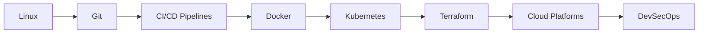

<!-- Stylish DevOps GitHub Profile README.md -->

<h1 align="center">👋 Hey there, I'm Rakesh Aragodi</h1>
<h3 align="center">🚀 DevSecOps | Cloud | CI/CD | Automation Enthusiast 💡</h3>

  

---

## 🔧 About Me

- 👨‍💻 Currently working as a **DevSecOps Engineer** at **Tata Consultancy Services (TCS)**
- 🔭 Building **secure CI/CD pipelines**, **infrastructure as code**, and automations
- 🌱 Exploring **Kubernetes**, **Terraform**, and **Cloud Native Security**
- ⚙️ Automating with **Python**, **Shell**, and **GitLab CI**
- 🎯 Passionate about **reliability**, **efficiency**, and **clean architecture**
- 🧠 Learning by **breaking things in test environments** 😄
- 💬 Ask me about **DevOps**, **Docker**, **Cloud**, or anything tech!

---

## 🛠️ Tech Stack & Tools

### 🚀 Platforms & OS

### ⚙️ CI/CD & Automation

### 🐳 Containerization & Orchestration

### ☁️ Cloud & IaC

### 🔐 Security & Quality

---

## 📊 GitHub Stats

  
  

---
## 📚 DevOps Journey

---
## 📇 Contact Info

   
 
⭐️ Thanks for visiting my DevOps world! ⭐️

---
